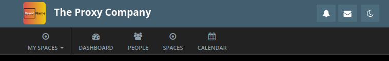

# Brand Name


A lightweight HumHub module that displays the configured application name next to the site logo in the top navigation bar.
This module originated while exploring extension mechanisms introduced with HumHub 1.18.x.



## Features

* Displays the application name beside the logo in the top menu.
* Keeps the default HumHub behavior when no logo is configured.
* No changes to HumHub core files.
* No JavaScript required.
* Implemented using HumHub's widget event system (`SiteLogo::EVENT_AFTER_RUN`).

## Requirements

* HumHub 1.18.x

## Installation

1. Copy or clone the module into your HumHub modules directory:

   ```text
   protected/modules/brandname
   ```

   or, depending on your installation (e.g. mapped docker volume):

   ```text
   [Volume] -> /var/lib/humhub
   /var/lib/humhub/modules/brandname
   ```

2. Open **Administration → Modules**.

3. Enable the **Brand Name** module.

4. **Clear** the HumHub cache.

5. **Important:** If you change the application name in the HumHub settings after enabling the module, clear the HumHub cache. Otherwise, the updated logo output may be rendered without the module's CSS, causing the application name to appear with the default font styling.

## How it works

HumHub normally displays either the site logo or the application name in the top navigation bar.

This module listens to the humhub\widgets\SiteLogo widget's EVENT_AFTER_RUN event and modifies the generated HTML output to append the configured application name whenever a site logo is displayed.

The original HumHub behavior remains unchanged if no logo has been configured.

## Technical Notes

Besides its functional purpose, this module serves as a compact example of how to extend HumHub 1.18.x using the official widget event system.

It demonstrates how to modify the rendered output of the `humhub\widgets\SiteLogo` widget by listening to `Widget::EVENT_AFTER_RUN`, avoiding core modifications, view overrides, and client-side DOM manipulation.

Developers migrating existing modules to HumHub 1.18.x may find this implementation useful as a reference for adapting UI customizations to the current extension mechanisms.

## Compatibility

This module has been developed and tested with HumHub **1.18.x**.

## License

MIT License

## Author

Developed by Roland Johannes | Leibniz Institute for Research and Information in Education
